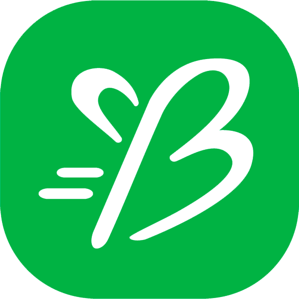

  

<h3 align="center">BetterMe</h3>

---

 Betterme is an social network application focused on healthy life style topics.
      

## 📝 Table of Contents
- [About](#about)
- [Coding style](#coding_style)
- [Usage](#usage)
- [Built Using](#built_using)
- [Authors](#authors)
- [Acknowledgments](#acknowledgement)

## 🧐 About 
This project is the android mobile version of Betterme. There are three versions in total:
- Mobile(this)
- [Desktop](https://github.com/Cuaju/betterme-desktop2)
- [Web](https://github.com/Guashasha/betterme-web)

All versions consume the same API based on microservices architecture. In this specific version you can create a profile, log in the app, share posts and keep track of your health.

## ✍️ Coding style 
You can find the coding style for this project [here](https://github.com/Pale04/betterme-mobile/blob/main/StyleGuides/KotlinStyleGuide.md).

## 🎈 Usage 
1. The application needs the [BetterMe API](https://github.com/Pale04/betterme-api) running for its correct operation.
2. The API URLs are harcoded in the [build.gradle.kts](https://github.com/Pale04/betterme-mobile/blob/main/app/build.gradle.kts) file. You need to change it depending on the device where the API container stays.

## ⛏️ Built Using 
- **Kotlin** - Programming language
- **Jetpack Compose** - UI tool
- **Retrofit** - API communication
- **Gradle** - Build configuration
- **MVVM** - Code structure

## ✍️ Authors 
- [@Pale04](https://github.com/kylelobo) - Initial work

## Acknowledgement 
This is a project developed in a educational enviroment